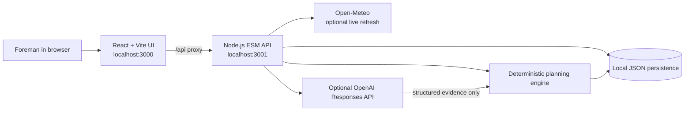
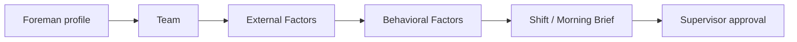
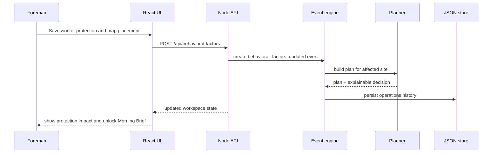
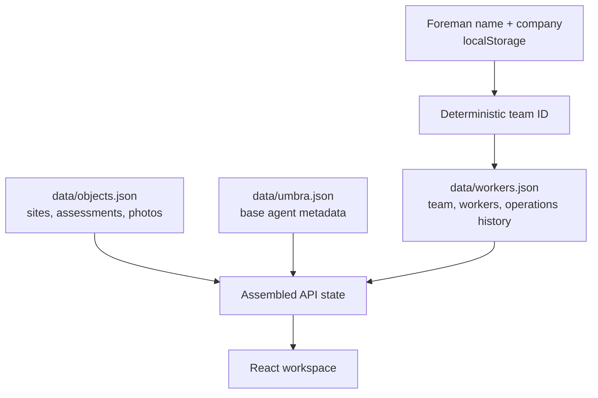

# Umbra architecture

Umbra is a local-first, evidence-to-decision MVP for planning UV-safety relief breaks for outdoor crews. Its core principle is:

```text
Worksite evidence + weather + crew profile + protection + placement
                                ↓
                  deterministic exposure and coverage rules
                                ↓
               explainable, supervisor-approved Morning Brief
```

The deterministic planner is the safety authority. Optional model output enriches evidence assessment and explanation, but cannot override coverage or exposure constraints.

## System context



## Runtime services

| Layer                 | Technology                        | Responsibility                                                                                               |
| --------------------- | --------------------------------- | ------------------------------------------------------------------------------------------------------------ |
| Browser UI            | React 19, React Router, Zustand   | Guided workflow, visual worksite map, local interaction state, and decision presentation.                    |
| UI development server | Vite                              | Serves the React app on port `3000` and proxies `/api/*` to the local API.                                   |
| Application API       | Node.js native `http` server, ESM | Validates requests, assembles workspace state, invokes planning modules, and persists results.               |
| Decision engine       | Local JavaScript modules          | Computes exposure, scores workers, validates coverage, builds rotations, and produces explainable decisions. |
| Runtime persistence   | Local JSON                        | Stores a foreman's team, operations history, object evidence, and images for the demo.                       |
| Weather source        | Open-Meteo                        | Refreshes UVI, temperature, and cloud cover when reachable; keeps the recorded forecast if unavailable.      |
| Optional AI layer     | OpenAI Responses API              | Produces structured site-photo and evidence reasoning when a server-side key is configured.                  |

## Browser application

`index.html` mounts `src-react/main.jsx`, which owns the React application shell and routes.

React is the only active browser entrypoint. The older static assets under `public/` are retained as legacy artifacts and are not part of the current runtime.



### Workflow gates

The UI intentionally prevents the supervisor from jumping straight to a plan without evidence:

1. **Foreman profile** — creates a local workspace identity using foreman name and company.
2. **Team** — adds at least one active employee profile.
3. **External Factors** — saves a worksite assessment containing a location, at least two images, weather, and surface context.
4. **Behavioral Factors** — records PPE/UPF, SPF, sunscreen timing, shade, and an on-image position for every employee.
5. **Shift / Morning Brief** — becomes available once an affected site has a valid plan.

`Live Incident` and `Reports` intentionally remain disabled in the current MVP.

### Frontend modules

| Module                            | Purpose                                                                                                 |
| --------------------------------- | ------------------------------------------------------------------------------------------------------- |
| `src-react/main.jsx`              | Application routes, onboarding, header, team screen, external-evidence screen, and workflow navigation. |
| `src-react/umbra-data.js`         | Zustand store, browser-local profile keys, API client, and workflow completion helpers.                 |
| `src-react/Behavioral.jsx`        | Per-worker PPE/SPF/shade editor, live risk preview, plan-rebuild action, and placement workflow.        |
| `src-react/BehavioralMap.jsx`     | Interactive worksite-image placement map.                                                               |
| `src-react/ProtectionChoices.jsx` | Reusable protection-status controls.                                                                    |
| `src-react/Shift.jsx`             | Morning Brief: priority worker, planned route, rotation sequence, approval, and explainability.         |
| `src-react/ProtectedShift.jsx`    | Protects Morning Brief from incomplete upstream workflow data.                                          |
| `src-react/PlanUpdatedResult.jsx` | Feedback shown after applying protection and rebuilding a plan.                                         |
| `src-react/rotation-display.js`   | Converts planner rotation windows into display-ready break details.                                     |
| `src-react/*.css`                 | Screen-specific visual system and map styles.                                                           |

## API and application service

`server.mjs` is the API composition layer. It reads the selected foreman workspace, hydrates its operations history, invokes the domain modules, then persists the new state.

### Key endpoint groups

| Group                    | Examples                                                                                      | Purpose                                                                                           |
| ------------------------ | --------------------------------------------------------------------------------------------- | ------------------------------------------------------------------------------------------------- |
| State and model status   | `GET /api/state`, `GET /api/model/status`                                                     | Loads the current local workspace and reports whether optional model access is configured.        |
| Team                     | `POST /api/team-member`, `POST /api/team-member/:id`, `POST /api/team-member/:id/delete`      | Creates, edits, and removes employee profiles.                                                    |
| Worksite evidence        | `POST /api/property/preview`, `POST /api/property/confirm`, `POST /api/property/:id/delete`   | Analyses and saves object photos, location, weather, and site assessment.                         |
| Protection and placement | `POST /api/behavioral-factors/preview`, `POST /api/behavioral-factors`                        | Calculates protection impact and records a worker's work-zone placement.                          |
| Morning Brief            | `POST /api/shift/rebuild`, `POST /api/shift/approve`                                          | Recovers/rebuilds a missing plan on explicit Morning Brief entry and records supervisor approval. |
| Operations               | `POST /api/replan`, `POST /api/refresh-conditions`, `POST /api/scenario`, `POST /api/what-if` | Supports event-driven replanning and scenario evaluation.                                         |

All browser API requests use the Vite proxy, so the browser calls relative `/api/*` URLs and never receives an OpenAI key.

## Domain and decision engine

The planner is split into small modules under `src/`.

| Module                  | Responsibility                                                                                                             |
| ----------------------- | -------------------------------------------------------------------------------------------------------------------------- |
| `planner-core.mjs`      | Exposure formula, worker score, plan validation, deterministic plan creation, and decision-object construction.            |
| `rotation-windows.mjs`  | Generates the timing and duration of protected relief windows.                                                             |
| `planner-workflows.mjs` | Event ingestion, affected-site detection, portfolio ranking, property assessment, roster handling, and what-if simulation. |
| `planner-evidence.mjs`  | Builds the strict evidence packet, structured evidence-agent output, model status, and model routing.                      |
| `planner-vision.mjs`    | Optional image analysis for audit photos and property photos.                                                              |
| `planner.mjs`           | Public barrel export used by the API server.                                                                               |

### Planning calculation

The engine first calculates external exposure:

```text
doseIndex = UV index × sun/time factor × cloud factor × albedo factor
```

Then it applies operational worker modifiers:

```text
workerScore = doseIndex
            × heat modifier
            × equipment modifier
            × risk tier
            × self-reported sensitivity / age / Fitzpatrick context
            × PPE factor
            × active SPF factor
            × shade factor
```

The output is a validated plan containing:

- ranked `priorityWorkers`;
- 20-minute `rotationBlocks`;
- environmental evidence and confidence;
- safety alerts and reasoning chain;
- trade-offs and a lower-priority alternative;
- a supervisor-review status where coverage constraints require it.

### Coverage safety rules

- Breaks cannot be shorter than 15 minutes.
- For multi-person sites, the engine cannot rotate the whole active crew out at once.
- A one-person site is represented as a **supervisor-reviewed coverage handoff** rather than discarded as a missing plan. It explicitly requires supervisor coverage before the relief break.
- A supervisor approval records the scheduled break; it does not alter the worker's visual map position. Position changes remain a separate worksite check-in.

## Event-driven replanning

Umbra monitors state but does not continuously rewrite plans. `processEvent()` rebuilds only affected sites when an operational event is received, such as:

- weather or cloud condition update;
- property imagery or photo-audit assessment;
- worker protection/placement update;
- worker absence;
- equipment failure;
- heat advisory;
- explicit Morning Brief rebuild request.

`runAutonomousCycle()` exists as a scenario/demo utility in the workflow module, but no recurring browser or server timer calls it in the released MVP.



## Evidence and optional GPT-5.6 layer

The app is functional without an API key. In that mode, it uses the deterministic planner and repeatable demo image assessment. It must not be described as a live model call.

When `OPENAI_API_KEY` is present on the server:

| Workload                                                             | Configurable default | Role                                  |
| -------------------------------------------------------------------- | -------------------- | ------------------------------------- |
| Cross-site prioritisation, incident response, final comparison       | `gpt-5.6-sol`        | Strategic evidence-agent reasoning.   |
| Routine image summaries, timeline wording, lower-risk classification | `gpt-5.6-luna`       | Frequent/routine structured analysis. |

The model receives a structured evidence packet and returns structured output. The server is the only code allowed to call a model. The approved tool boundary is limited to weather refresh, worker-condition lookup, photo evidence lookup, and read-only absence simulation.

## Persistence model

Umbra is currently a local demo rather than a multi-tenant production service.



| File                        | Stored data                                                                                    | Git status            |
| --------------------------- | ---------------------------------------------------------------------------------------------- | --------------------- |
| `data/workers.json`         | Foreman/team profile, employees, event history, decisions, plans, audit entries, and activity. | Ignored runtime data. |
| `data/objects.json`         | Object metadata, property photos, current forecast, image assessment, and albedo context.      | Ignored runtime data. |
| `data/umbra.json`           | Shared base state and agent metadata.                                                          | Ignored runtime data. |
| `data/workers.example.json` | Example team persistence shape.                                                                | Committed.            |
| `data/objects.example.json` | Example object-evidence persistence shape.                                                     | Committed.            |

Browser `localStorage` only holds the selected local foreman identity and small workflow flags. It is not authentication.

## Trust and privacy boundaries

- No OpenAI key is sent to the browser.
- Medical markers, sensitivity, and Fitzpatrick context are self-reported occupational-health inputs; Umbra does not infer physiology from a photo.
- Uploaded worksite images and employee context are local demo data and should not be committed.
- The app is decision support, not a medical diagnosis, legal guarantee, or substitute for a supervisor's safety judgement.
- Productionisation would require authenticated accounts, a database, tenant isolation, secure object storage, access controls, audit/export controls, retention policy, and formal safety/compliance review.

## Local development topology

```bash
npm install
npm run dev
```

`npm run dev` starts both required processes:

| Process      | Port   | Purpose                                                        |
| ------------ | ------ | -------------------------------------------------------------- |
| Vite / React | `3000` | User interface.                                                |
| Node API     | `3001` | Planner, persistence, weather, and optional model integration. |

For a production frontend bundle, run `npm run build`; Vite writes the compiled UI to ignored `dist/`.
